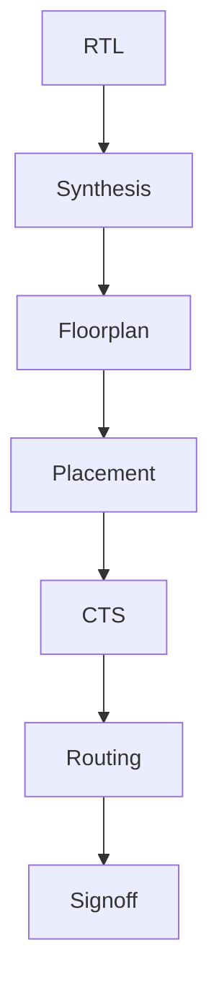

# SoC Design and Planning

## Overview
This repository documents a complete learning journey through a Digital SoC Design and Planning workshop using open-source ASIC tools.

## Topics
- ASIC Design Flow
- RTL to GDSII
- OpenLANE
- OpenROAD
- Sky130 PDK
- Floorplanning
- Placement
- CTS
- Routing
- DRC/LVS

## Repository Structure

```
Day1-Day5   Daily documentation
Resources   Reference material
Scripts     Useful scripts
Reports     Generated reports
```

## ASIC Design Flow



## Tools
|Tool|Purpose|
|---|---|
|Yosys|Logic Synthesis|
|OpenROAD|Physical Design|
|Magic|Layout & DRC|
|Netgen|LVS|
|ngspice|Simulation|

## Author
Ayushmaan Sharma
